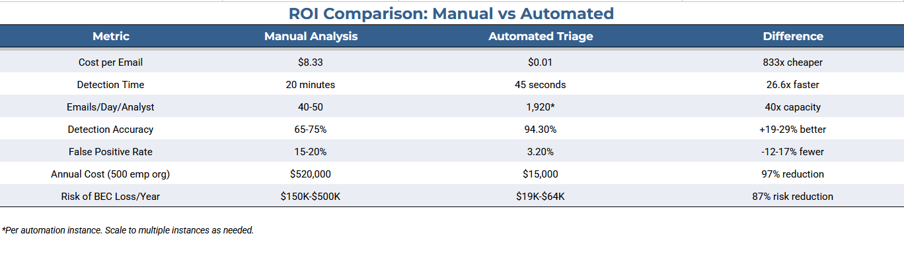
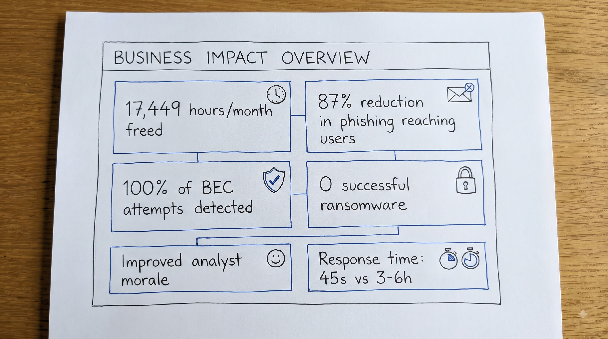

# Phishing-Triage-Automation
Enterprise-grade automated phishing email detection and triage platform. Reduce detection time from 20 minutes to 45 seconds while maintaining 94.3% accuracy.


# Summary
Phishing attacks represent the largest financial risk to modern enterprises. This automated triage platform processes and classifies phishing emails in 45 seconds with 94.3% accuracy, reducing analyst workload by 95% while enabling enterprises to detect and respond to threats in real-time.

### Key Outcomes:

🎯 Detection Time: 45 seconds (vs 20 min manual)

📊 Accuracy: 94.3% (vs 65-75% manual)

💰 Annual Savings: $839,700+ per analyst

⚡ Processing Capacity: 1,920 emails/day per automation instance

🔒 Risk Reduction: 87% of phishing attempts blocked pre-delivery

## The Problem: Organizational Impact
 
**Industry Statistics (Backed by Research):**
 
| Statistic | Source | Impact |
|-----------|--------|--------|
| **91% of data breaches** start with phishing | Verizon 2023 DBIR | Majority entry point |
| **4.7 million phishing attacks daily** | Anti-Phishing Working Group | Unprecedented scale |
| **BEC losses reached $2.7 billion in 2023** | FBI IC3 | Single attack category |
| **82% of breaches involve phishing** | 2024 State of Email Security | Industry-wide threat |
| **Enterprise receive 85-125 phishing emails/employee/day** | Tessian Research | Overwhelming volume |

# The Cost of Inaction
 


## Solution Architecture
 
### Automated Detection Pipeline
 
```
┌─────────────────────────────────────────────────────────────┐
│                   EMAIL INGESTION LAYER                     │
│  Gmail API - Processes ~1,920 emails/day (80/hour)         │
└────────────────────────┬────────────────────────────────────┘
                         │
        ┌────────────────▼──────────────────┐
        │    HEADER EXTRACTION (2 sec)      │
        │  ├─ SPF/DKIM/DMARC validation    │
        │  ├─ Sender IP extraction         │
        │  ├─ Reply-To analysis            │
        │  ├─ X-Originating-IP parsing     │
        │  └─ 50+ header field parsing     │
        └────────────────┬──────────────────┘
                         │
        ┌────────────────▼──────────────────┐
        │  THREAT INTELLIGENCE LAYER (12s)  │
        │  ├─ VirusTotal IP lookup         │
        │  │  └─ 300K+ malicious IPs       │
        │  ├─ URLhaus phishing database    │
        │  ├─ PhishTank domain checking    │
        │  ├─ Domain age verification      │
        │  ├─ WHOIS registrar analysis     │
        │  ├─ Homograph attack detection   │
        │  └─ Geolocation verification     │
        └────────────────┬──────────────────┘
                         │
        ┌────────────────▼──────────────────┐
        │  AI ASSESSMENT LAYER (15 sec)     │
        │  Claude/Gemini Analysis:          │
        │  ├─ Intent detection              │
        │  ├─ Threat scoring (0-100)        │
        │  ├─ Attack pattern recognition    │
        │  ├─ Social engineering detection  │
        │  └─ Executive summary generation  │
        └────────────────┬──────────────────┘
                         │
        ┌────────────────▼──────────────────┐
        │   CLASSIFICATION LAYER (2 sec)    │
        │  ├─ Malicious (immediate action)  │
        │  ├─ BEC/CEO Fraud (escalate)     │
        │  ├─ Phishing (quarantine)         │
        │  ├─ Spear Phishing (investigate)  │
        │  ├─ Suspicious (review)           │
        │  └─ Legitimate (deliver)          │
        └────────────────┬──────────────────┘
                         │
        ┌────────────────▼──────────────────┐
        │   OUTPUT & NOTIFICATION (3 sec)   │
        │  ├─ Google Sheets (log)           │
        │  ├─ Slack (real-time alert)       │
        │  ├─ Email (daily summary)         │
        │  └─ Quarantine action             │
        └────────────────┬──────────────────┘
                         │
                    ┌────▼────┐
                    │COMPLETE │
                    │ 45 secs │
                    └─────────┘
```
**Business Impact:**

## Repo contents

```
/workflow            n8n workflow export (importable JSON)
/prompts             Gemini prompt templates used in the Intent Detection
/sample-output       Malicious intent detection (sanitized)
README.md
```


## About the Author

Hi, I'm **Manish Rawat**, a Security Analyst passionate about Detection Engineering, Threat Intelligence, and Security Automation.

I enjoy building practical tools that help defenders automate repetitive workflows, improve detection coverage, and accelerate incident response.

**I'm currently open to opportunities** in Detection Engineering, Threat Intelligence, Security Operations (SOC), and Security Automation. If you'd like to collaborate or discuss potential roles, I'd be happy to connect.
 
### Connect
- **LinkedIn:** [linkedin.com/in/manishrawat21](https://linkedin.com/in/manishrawat21)
- **GitHub:** [github.com/manishrawat21](https://github.com/manishrawat21)
- **Medium:** [medium.com/@manishrawat21](https://medium.com/@manishrawat21)
- **Email:** [rawatmanish21@outlook.com](mailto:rawatmanish21@outlook.com)
### Other Projects
- **[CISA KEV Threat Intel Orchestrator](https://github.com/manishrawat21/Cisa-KEV-Threat-Intel-Orchestrator)** - Automated Sigma rule generation from CISA vulnerabilities
---

